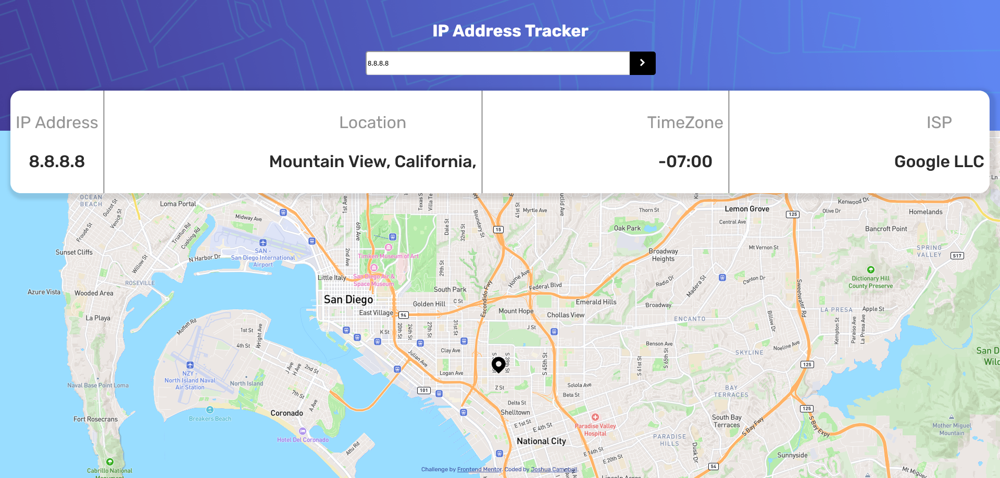

# Frontend Mentor - IP address tracker solution

This is a solution to the [IP address tracker challenge on Frontend Mentor](https://www.frontendmentor.io/challenges/ip-address-tracker-I8-0yYAH0). Frontend Mentor challenges help you improve your coding skills by building realistic projects. 

## Table of contents

- [Overview](#overview)
  - [The challenge](#the-challenge)
  - [Screenshot](#screenshot)
  - [Links](#links)
- [My process](#my-process)
  - [Built with](#built-with)
  - [What I learned](#what-i-learned)
  - [Continued development](#continued-development)
  - [Useful resources](#useful-resources)
- [Author](#author)

**Note: Delete this note and update the table of contents based on what sections you keep.**

## Overview

### The challenge

Users should be able to:

- View the optimal layout for each page depending on their device's screen size
- See hover states for all interactive elements on the page
- See their own IP address on the map on the initial page load
- Search for any IP addresses or domains and see the key information and location

### Screenshot

### Links

- Solution URL: [Add solution URL here](https://your-solution-url.com)
- Live Site URL: [Add live site URL here](https://your-live-site-url.com)

## My process

### Built with

- CSS custom properties
- Desktop-first workflow
- [React](https://reactjs.org/) - JS library
- [TypeScript](https://www.typescriptlang.org/) - For React
- [Vite.js](https://vitejs.dev/) - JS library
- [PostMan](https://www.postman.com/) - To Test 3rd party API's

### What I learned

I have managed to apply the basics of TypeScript from my experience and learned how to use TypeScript within a React project and 
how to write clean and effective code within the Components.

I have also learned how to use Custom Markers within a Map instead of using the default Marker and how to display it within the Map. 

I also used PostMan to test the API endpoints so i could structure TypeScript interfaces and how to handle the data for the website.

Use this section to recap over some of your major learnings while working through this project. Writing these out and providing code samples of areas you want to highlight is a great way to reinforce your own knowledge.

### Continued development

Well what I am planning to update is maybe improve the CSS design for Mobile Devices as it is a bit off from the designs that are provided as part of this project.

### Useful resources

- [Secure API Keys in Vite + React](https://medium.com/@haitham.benhammouda/getting-started-with-env-in-react-vite-06a185ffcf06) - This helped me for securing API Keys reason.
- [Setting Up MapBox with React + TypeScript](https://dev.to/franklin030601/showing-mapbox-map-with-react-55g) - This is an amazing article which helped me finally understand how to setup MapBox with React/TypeScript. I'd recommend it to anyone still learning this concept.

## Author

- Website - [Joshua Campbell](https://www.joshua-campbell.net/)
- Frontend Mentor - [@jcampb98](https://www.frontendmentor.io/profile/jcampb98)
- LinkedIn- [Joshua Campbell](https://www.linkedin.com/in/joshua-campbell98/)